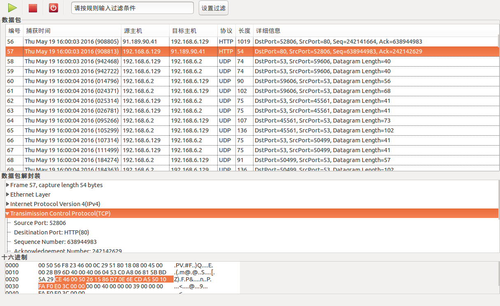

#swordSniffer
****   

##Introduction

**swordSniffer** is a graphical sniffer of network packet on ubuntu.  

##Develop environment

- Gtk+3.0
- Glade3.0
- libpcap

##Build

- git clone https://github.com/onestraw/traffic-analysis
- cd traffic-analysis/swordsniffer
- make
- sudo ./sniffer

##Screenshot

##About

- author: `geeksword`
- email: geeksword@163.com
- blog: http://onestraw.net
